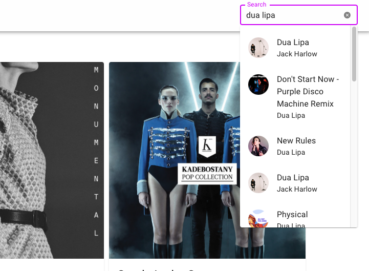

## Table of Contents
1. [General Info](#general-info)
2. [Technologies](#technologies)
3. [Installation](#installation)
4. [Your Turn](#your-turn)
### General Info
***
This applicaiton is a basic music player. It uses spotify apis.
### Images
 

## Technologies
***
* [React](https://reactjs.org): Version 18.1.0
* [spotify-web-api-node](https://www.npmjs.com/package/spotify-web-api-node): Version 5.0.2
* [react-spotify-web-playback](https://www.npmjs.com/package/react-spotify-web-playback): Version 0.9.2
* [Material UI](https://v4.mui.com): Version 5.6.4

## Installation
***
You have to get your Client id and Client secret from spotify developer section. 
Replace it in server.js file and SpotifyApi.js file.
Replace the user id  that you search for in home page.
```
$ git clone https://github.com/barisyasar/my-spotify-web.git
$ cd server
$ npm install
$ npm run devStart
$ cd ..
$ cd client
$ npm install
$ npm start
```

## Your Turn
***
In this app, you need a code that comes from spotify. When you refresh the page the disappers.
So, to prevent this create a local storage that keeps the code.
